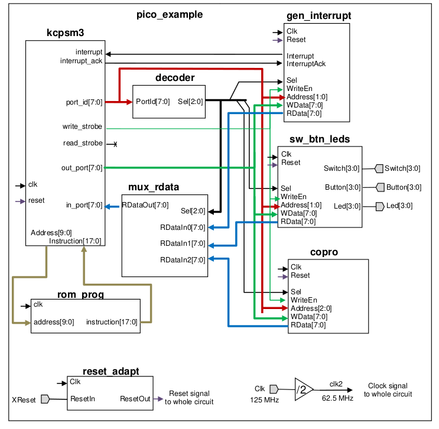

# PicoBlazeFPGA

El procesador PicoBlaze es un soft core de 8 bits de Xilinx en el que cada 
dispositivo está mapeado a una dirección de memoria. Cuenta con un juego de
instrucciones reducido y 16 registros de 8 bits de proposito general.

En esta práctica se ha implementado en una FPGA un microcontrolador con el 
procesador PicoBlaze para la placa Zybo de Xilinx.

La arquitectura del microcontrolador implentada es la siguiente:

Para poder probar y usar el proyecto se ha usado:

- Vivado v2021.2 - Xilinx
- [openbasm v1.3](https://kevinpt.github.io/opbasm/)
- [Manual PicoBlaze](./assets/docs/KCPSM3_Manual.pdf)

El proyecto dispone de un testbench y un [programa ejemplo](./PicoBlazeFPGA/soft/Linux/rom_prog.psm)
que permite comprobar el funcionamiento del microcontrolador.

Nota: Si se modifica el programa ejemplo debe ser recompilado mediante
la herramienta openbasm para que genere el esquema vhd resultante de la memoria
utilizada por el microprocesador.
